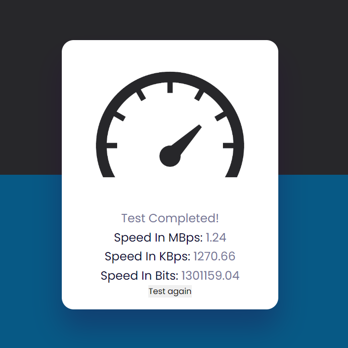

# Speed-Test

This project lets you find the speed of our internet based on the response of an image API.
This is build using HTML, CSS and Javascript
and it is uploaded to github via git.

## Screenshot

Here is the screenshot of the project

# Docker Image
https://hub.docker.com/r/sivaneshdsp/speed-test
